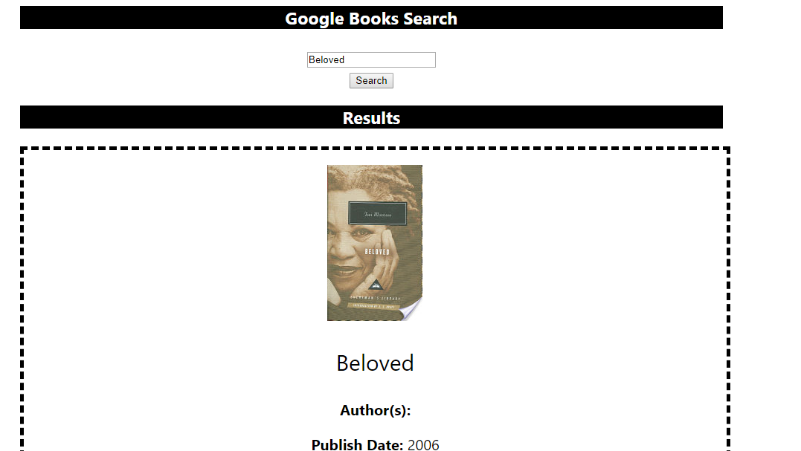
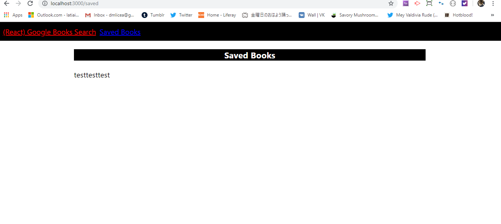

* React Google Books Search

* * Create a react based app lthat uses the Google Books API and returning information on authors, titles, and subjects. You should be able to use methods to query and display books based on user searches.

* * This application requires at minimum 2 pages, check out the following mockup images for each page:

 * * * Search - User can search for books via the Google Books API and render them here. User has the option to "View" a book, bringing them to the book on Google Books, or "Save" a book, saving it to the Mongo database.

* * * Saved - Renders all books saved to the Mongo database. User has an option to "View" the book, bringing them to the book on Google Books, or "Delete" a book, removing it from the Mongo database.

* * Technologies Used

* * * Node 
* * * React
* * * Express
* * * MongoDB
* * * Axios
* * * CSS
* * * JavaSctopt

* * 
* * 

https://stormy-fortress-32037.herokuapp.com/